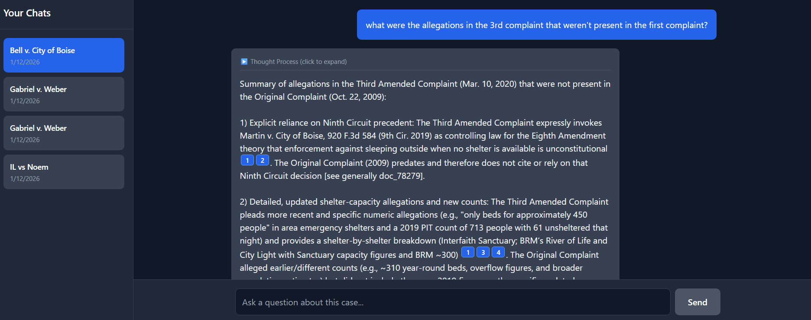
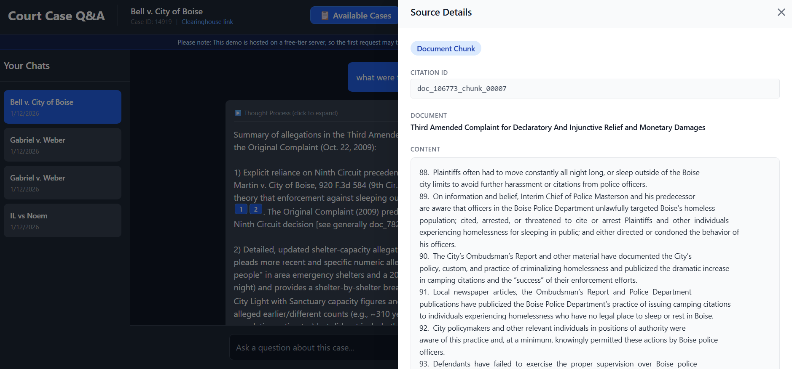
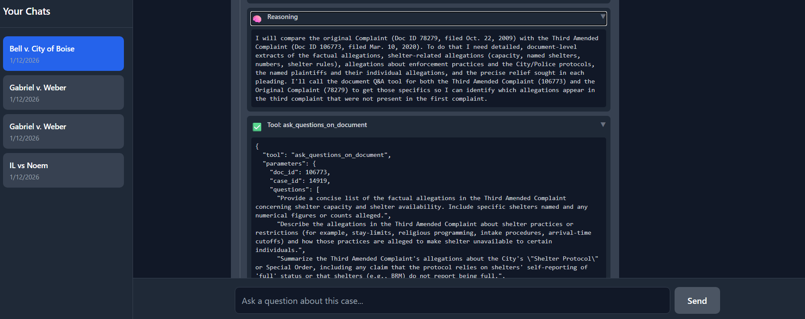
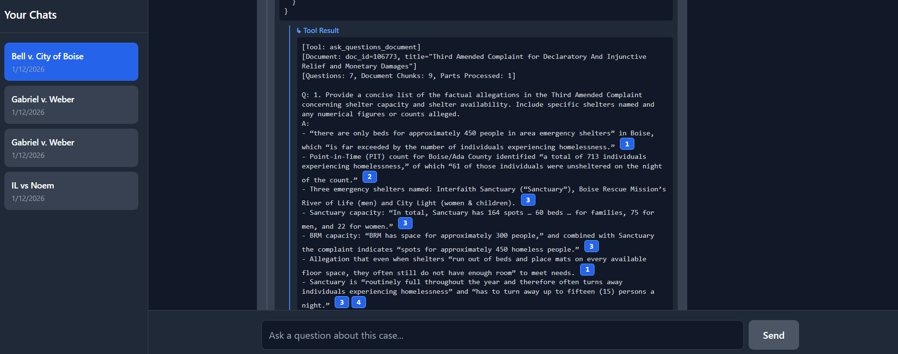

# Court Case Question Answering App

**Demo URL:** https://court-case-question-answering-app.vercel.app/

**Example Chat Session:** https://court-case-question-answering-app.vercel.app/chat/1063dd43-d1ea-4b8d-b00c-0b58ee57cc3a

## Overview

This demo app allows users to evaluate an AI chatbot's ability to answer questions about court cases that are publicly available via the University of Michigan's Civil Rights Litigation Clearinghouse. The application employs a multi-agent reasoning architecture where a **Planner Agent** orchestrates research by calling specialized tools, and an **Executor Agent** answers targeted questions by analyzing full document texts using a map-reduce pattern. 

Users can ask complex questions about court cases, and the system iteratively gathers context through multiple reasoning steps, queries specific documents for detailed information, and synthesizes comprehensive answers with precise citations to source chunks. All reasoning steps, tool calls, and their results are streamed in real-time to provide full transparency into the AI's decision-making process.

The main logic is how the system handles extremely long court documents (often hundreds of pages). Rather than relying on semantic search over embedded chunks—which proves ineffective due to the similarity of legal language across documents—the system provides the Planner Agent with high-level summaries of all documents and docket entries during preprocessing. 

The Planner then selects which documents to query in-depth using the `ask_questions_on_document` tool, which invokes the Executor Agent to analyze the complete document text and return detailed answers with citations. This approach allows the system to navigate vast amounts of legal text while maintaining accuracy and providing verifiable, clickable citations for every claim made in the final answer.

> **Note:** Court case data comes from APIs that the University of Michigan kindly makes available for research and educational purposes.
>
> - **Reference:** https://clearinghouse.net/
> - **API Documentation:** https://clearinghouse.net/api

## Features

### Chat Interface with Real-Time Streaming



Users can ask questions about court cases in a conversational interface. The system streams responses in real-time, showing the agent's reasoning process as it works.

### Verifiable Citations with Source Documents



Each claim in the assistant's answer can be traced to specific document chunks in the case. Citations are clickable, allowing users to verify the source of the information.

### Transparent Reasoning Process



The agent's reasoning process is streamed in real-time for full transparency. Users can see exactly how the AI analyzes the question, decides which documents to examine, and synthesizes the final answer.

### Tool Call Execution and Results



The results of such tool calls are displayed for human review, showing exactly what information was gathered from which documents.

## Account and Session Management

Creating an account allows you to save your previous chat sessions to go back to later. Chat sessions persist in the database, so you can revisit conversations and continue where you left off.

> **Feedback:** If you want to point out incorrect behaviors in a chat session, please send me the chat session URL (automatically shared) so I can take a look.

## Adding New Cases (Currently Disabled)

Users can normally add new cases by providing the case ID as found on the Clearinghouse website. The app would "preprocess" a new case before the user can ask questions. However, **this feature is currently disabled** because the Clearinghouse APIs have just been updated, and the preprocessing logic needs to be adjusted accordingly.

## Key Takeaways for AI Agent Developers

### The Semantic Search Challenge

A court case might have a lot of documents, each of which can be super long. I initially tried chunking & embedding and used semantic search (as an available tool for the agent) to retrieve additional context for a user's question. **I found that to be ineffective.** After various optimizations, I found that the returned chunks generally have roughly the same similarity scores and are not directly relevant to the user's question. 

This is probably because most chunks contain legal language with similar legalese style, so semantic search fails to distinguish between directly relevant chunks vs other chunks that might have a similar legal/court case vibe. **Thus, the chunking that's done in preprocessing is strictly used for citations only.**

### The Keyword Search Limitation

I implemented keyword search as well as a tool, and the agent would try to use that when there are questions about very specific entities in the case. However, **the tool is brittle**, and the agent would go through many rounds of guessing which keywords would actually yield something useful. The agent often falls into failure loops where it keeps generating identical searches with different keyword orders, refusing to accept that the information isn't in the data. So I de-emphasized this tool in the system instructions.

### The Main Tool: Document-Targeted Q&A

**The most useful tool is for the main agent to ask targeted questions on specific documents.** The tool (`ask_questions_on_document`) uses another agent (the Executor Agent) to look at the entire document and provide detailed answers to the queries from the main agent, providing citations to the source as well.

The main agent, seeing the additional context with citation markers attached, will always use those citations when formulating final answers. The main agent can go through many steps of asking individual documents for necessary details, allowing for thorough research across multiple documents.

### Context Management Strategy

The main agent does not have access to the full text of all documents, because documents are very long. Instead, during preprocessing, **summaries of each document are generated** and provided as context to the main agent. 

Clearinghouse APIs also provide the docket entries, so a **summary of all those docket entries** (and their citation markers) is also provided to the main agent. This gives the Planner Agent enough high-level information to decide which documents are worth querying in depth.

### The Reasoning Loop

The reasoning loop implements a sophisticated context evolution strategy that balances completeness with token efficiency. Here's how it works:

#### Initial Context Building

The system starts by constructing a comprehensive initial context that includes:
- **System instructions** that define the agent's behavior and rules
- **Chat history** from the current session (up to 15,000 words, with truncation if exceeded)
- **Initial case context** containing document summaries, docket entry summaries, and case metadata
- **Tool specifications** describing available tools and their parameters
- **The user's question** to be answered

This initial context is built once at the beginning and serves as the foundation for all subsequent reasoning steps.

#### Iterative Reasoning with Context Evolution

The Planner Agent operates in an iterative loop (up to 20 steps maximum) where each iteration involves:

1. **LLM Call**: The agent receives the current context and responds with structured JSON containing:
   - `gathered_context`: Key information extracted from recent tool results
   - `reasoning_step`: The agent's current thinking and analysis
   - `tool_calls`: Tools to execute next (empty array signals readiness for final answer)

2. **Tool Execution**: If tool calls are requested, the Executor Service routes each tool call to the appropriate handler and streams results back immediately for responsive UI display.

3. **Context Evolution**: After each iteration, the context is evolved using a specific pattern that keeps the conversation focused while preventing context explosion:
   - **Always Keep**: Initial context (instructions, chat history, case summaries, tools, question)
   - **Always Keep**: ALL gathered contexts from previous steps (distilled insights)
   - **Always Keep**: ALL reasoning steps (the agent's thought process)
   - **Keep Only Recent**: ONLY the most recent tool results (they're bulky, but just-executed results are crucial)
   - **Discard**: Old tool results from previous iterations (they've been distilled into gathered_context)

This evolution strategy is designed this way because tool results (especially from document Q&A) can be very long. By discarding old tool results after their insights have been extracted into `gathered_context`, the system maintains a manageable context size while preserving all the distilled knowledge.

4. **Loop Termination**: The loop continues until either:
   - The agent returns empty `tool_calls` (indicating sufficient information), or
   - The maximum step limit (20) is reached

#### Final Answer Generation

Once the reasoning loop completes, a final LLM call is made with special instructions to synthesize all gathered contexts into a comprehensive answer. The agent is explicitly told not to call any more tools and to formulate the final response with proper citations using the `[CITE:chunk_id]` format.

The entire process is streamed to the frontend in real-time as NDJSON events, giving users full visibility into each reasoning step, tool call, and tool result as they happen.

### Model Selection: GPT-5-mini vs GPT-4o-mini

I found that **GPT-5-mini is better at reasoning through complex questions** and deciding which documents it needs to ask more questions about. On GPT-4o-mini, mistakes can include transferring citation markers incorrectly between reasoning steps (like citing `chunk_14` instead of `chunk_00014`, which would obviously break the clickable citation markers on the frontend). **GPT-5-mini appears to avoid those mistakes** and maintains more consistent citation formatting throughout the reasoning process.

## Development Setup

### Backend Setup

```bash
cd backend

# Create virtual environment
python -m venv venv
venv\Scripts\activate  # Windows
# source venv/bin/activate  # macOS/Linux

# Install dependencies
pip install -r requirements.txt

# Configure environment variables
cp .env.example .env
# Edit .env with your credentials

# Run database migrations
alembic upgrade head

# Start development server
uvicorn app.main:app --reload --host 0.0.0.0 --port 8000
```

### Frontend Setup

```bash
cd frontend

# Install dependencies
npm install

# Configure environment variables
cp .env.example .env
# Edit .env with your backend URL and Supabase credentials

# Start development server
npm run dev
```
